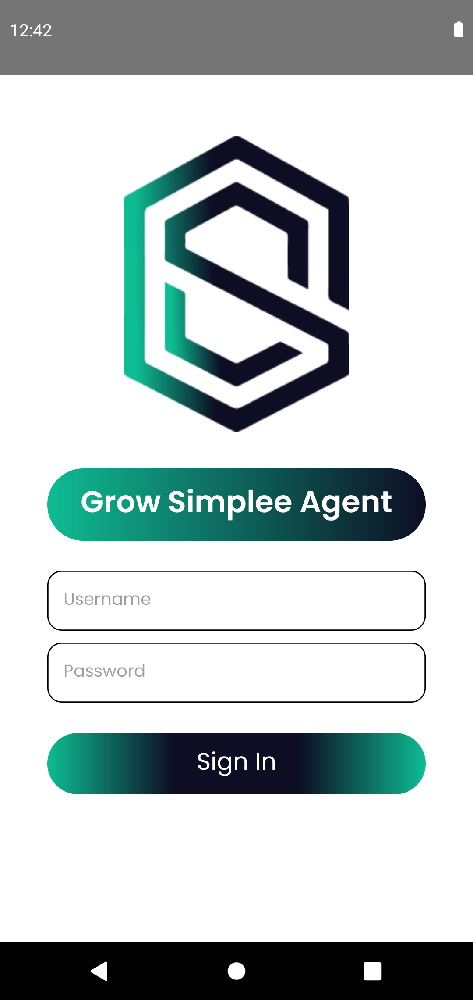
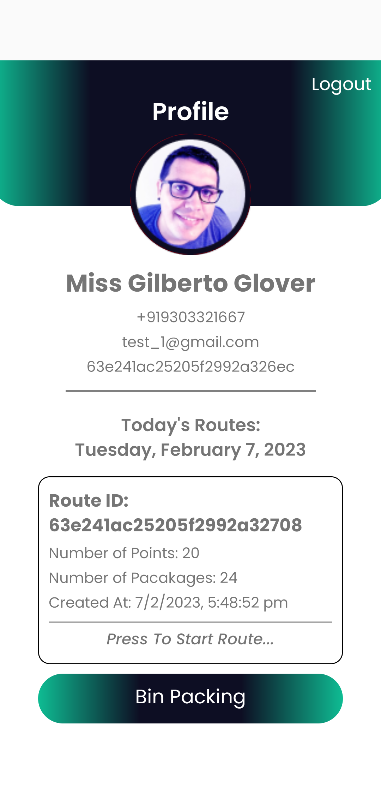
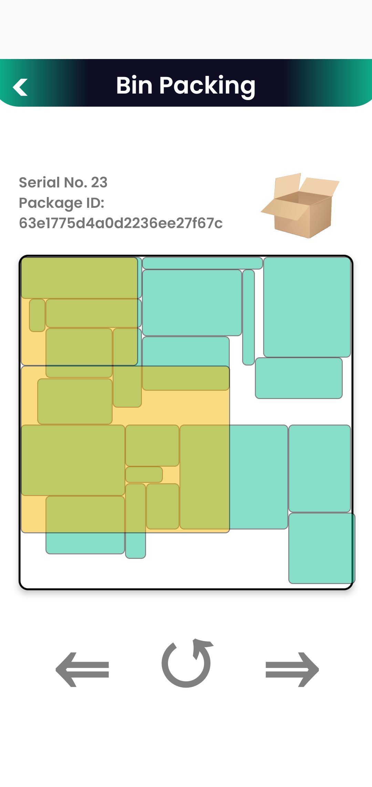
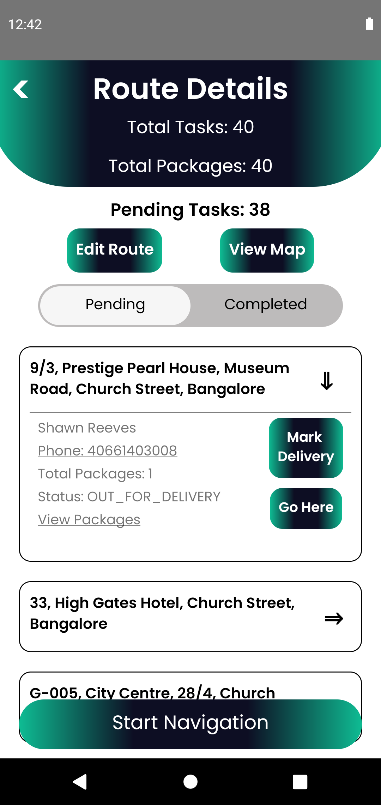
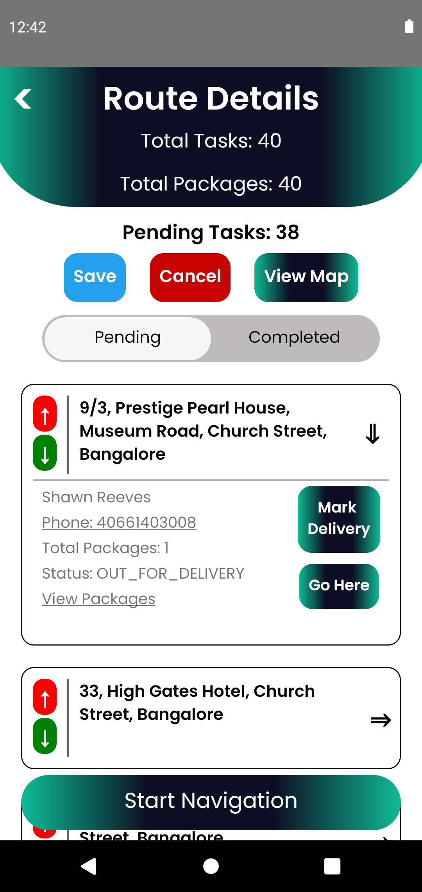
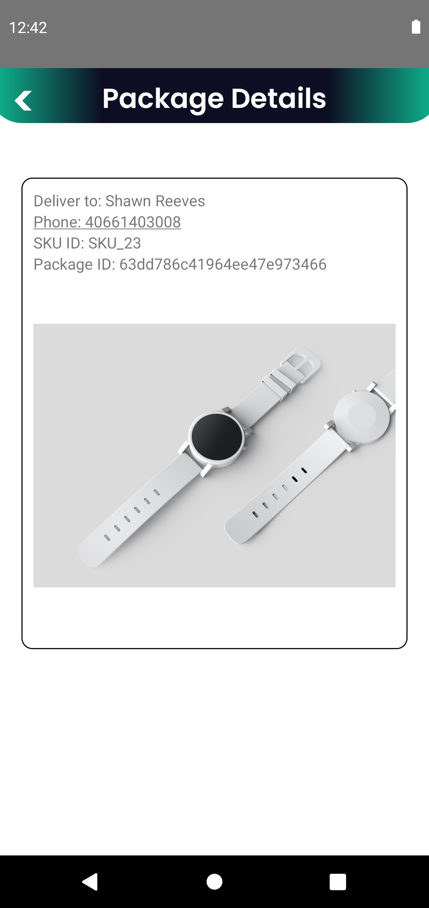
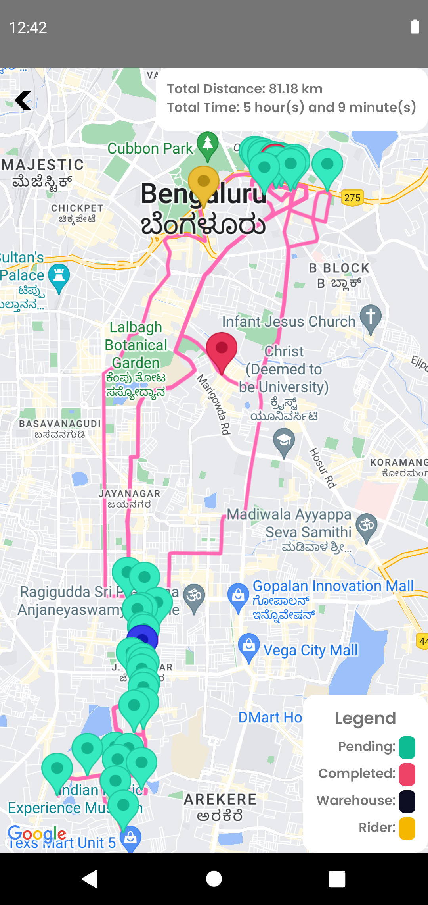
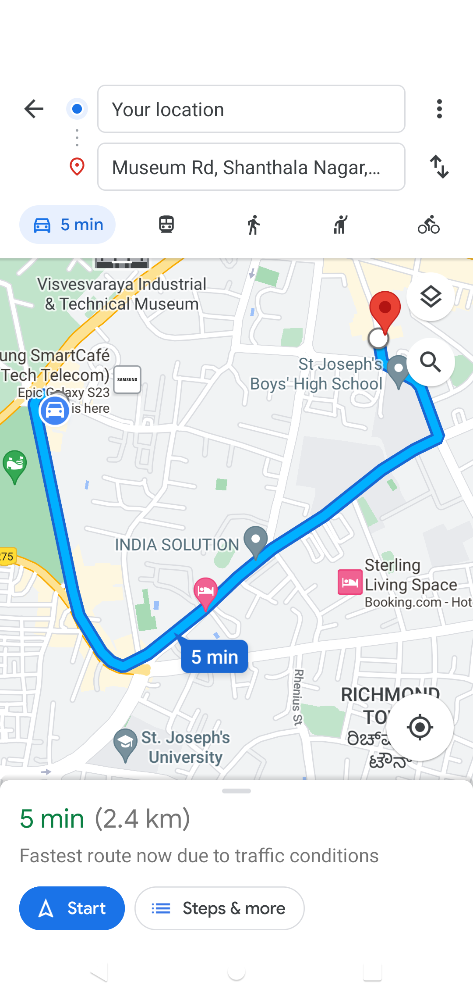

# Grow Simplee Agent Mobile App 

The App provides an intuitive interface to help delivery agents perform deliveries across a city. The App incorporates one-touch navigation and other delivery utilities to assist the agents in completing their delivery routes. App built using [React Native](https://reactnative.dev/) and [Android Studio](https://developer.android.com/studio)

## Screenshots

<div style="display: flex;">








</div>

## Features

- Rider Authorization
- Rider Profile
- Route Fetching
- Route Viewing
- Navigation
- Mark/Unmark Delivery/Pickup

## Requirements

- NodeJS
- React Native CLI
- Android Studio Emulator

## Setup Instructions

### 1. Install dependencies

```sh
# Clone the app repo
git clone https://github.com/Grow-Simplee-Team-11/Grow-Simplee-Agent
cd Grow-Simplee-Agent

# Install npm dependencies
npm install
```

### 2. Setup up Android Emulator

Follow the [React Native Environment Setup](https://reactnative.dev/docs/environment-setup), for setting up Android Development environment using React Native CLI (not Expo) and Android Studio.

App developed and tested for Android 11.0 using API >= 30 

### 3. Start the app

Start a Android Virtual Device (AVD) from Android Studio and run the following command from project root directory

```
npx react-native run-android
```
## Detailed Description

The app is developed using React Native and its libraries for Navigation, GPS Tracking and UI Design. The app workflow comprises of several React Native Screens like:

| **Screen** | **Description** |
|---|---|
| **Login** | Rider login using Admin provided username and password |
| **Rider Home** | Display Rider details and the Routes for the day |
| **Bin Packing** | Provide sequential step-by-step instructions for rider bin packing |
| **Route Screen** | Give details for the selected route with Mark/Unmark and GPS navigation facility |
| **View Map** | Display the complete route on a interactive Google Map with total distance and duration based on current traffic |
| **Package View** | View SKU ID, Package ID etc for all packages for the selected location |
| **Navigation** | Driving navigation to next pending delivery/pickup location provided through Google Maps App  |

## Status

As of version 1.0.5 the app works on Android 11.0 with API 30 and published on Google Play Store